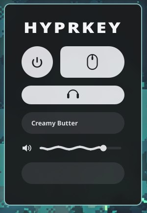

<p align="center">
  
</p>

<p align="center">
  
  
  
  
  
</p>

A lightweight mechanical keyboard and mouse sound generator for Linux. Instead of looping static audio samples, Hyprkey synthesizes every keypress and click in real time with near-zero latency.

<p align="center">
  
</p>

---

### Features

* **Procedural Audio** — No bloated `.wav` sound packs. Audio is generated on the fly with virtually no delay.
* **14 Switch Profiles** — Tuned for creamy, deep, and thocky profiles (Boba Jelly, Creamy Butter, Deep Thock, Marshmallow, Rain Drop, Topre, and more).
* **Headphone / IEM Mode** — Tames harsh high-end transients so your ears don't get fatigued.
* **Mouse Clicks** — Responsive click synthesis for mouse buttons.
* **Live Synth Controls** — 8 real-time sliders to tweak frequency, click transient, warmth, decay, pitch drop, duration, softness, and body resonance.

---

<p align="center">
  
</p>

### Installation

Run in your terminal:

```bash
curl -fsSL https://raw.githubusercontent.com/rootscripts/hyprkey/main/install.sh | bash
